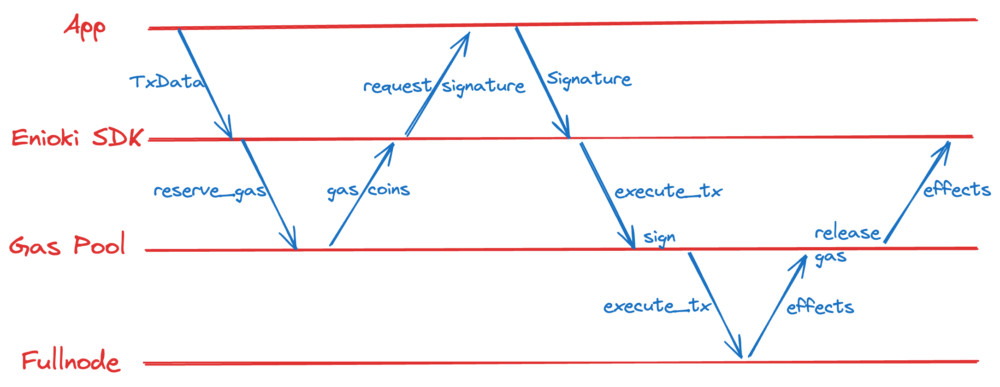

# Enoki Gas Pool
This is a high-level summary of how Enoki Gas Pool works.

## Assumptions
The Enoki Gas Pool will only be accessed from Enoki server, which handles rate limiting and user-level billing and authentication. The Gas Pool blindly trusts the requests it receives as long as a correct barer secret is provided in the RPC request.

## User Flow


## Architecture
There are 4 components in the Gas Station:
### Storage
The storage layer stores the global gas pool information.
It uses Redis store as the backend, and Lua scripts to control the logic.
Detailed documentation of each Lua script can be found in [link](src/storage/redis/lua_scripts/)

### Gas Pool Core
The Gas Pool Core implements the core gas pool logic that is able to process RPC requests and communicate with the Storage layer.
It has the following features:
1. Upon requesting gas coins, it's able to obtain gas coins from the storage layer and return them to the caller.
2. Caller can follow up with a transaction execution request that uses previously reserved coins, and the gas station core will drive the execution of the transaction, automatically release the coins back to the storage layer after the transaction is executed.
3. It's able to automatically release reserved gas coins back to the storage after the requested duration expires.

### Gas Pool Initializer
A Gas Pool Initializer is able to initialize the global gas pool, as well as processing new funds and adding new coins to the gas pool.
When we are starting up the gas pool for a given sponsor address for the first time, it will trigger the initialization process. It looks at all the SUI coins currently owned by the sponsor address, and split them into gas coins with a specified target balance. Once a day, it also looks at whether there is any coin owned by the sponsor address with a very large balance (NEW_COIN_BALANCE_FACTOR_THRESHOLD * target_init_balance), and if so it triggers initialization process again on the newly detected coin. This allows us add funding to the gas pool.
To speed up the initialization time, it is able tp split coins into smaller coins in parallel.
Before each initialization run, it acquires a lock from the store to ensure that no other initialization task is running at the same time. The lock expires automatically after 12 hours.
This allows us to run multiple gas stations for the same sponsor address.

### RPC Server
An HTTP server is implemented to take the following 3 requests:
- GET("/"): Checks the health of the server
- POST("/v1/reserve_gas"): Takes a [`ReserveGasRequest`](src/rpc/rpc_types.rs) parameter in JSON form, and returns [`ReserveGasResponse`](src/rpc/rpc_types.rs).
- POST("/v1/execute_tx"): Takes a [`ExecuteTxRequest`](src/rpc/rpc_types.rs) parameter in JSON form, and returns [`ExecuteTxResponse`](src/rpc/rpc_types.rs).

```rust
pub struct ReserveGasRequest {
    /// Desired gas budget. The response will contain gas coins that have total balance >= gas_budget.
    pub gas_budget: u64,
    /// The reserved gas coins will be released back to the pool after this duration expires.
    pub reserve_duration_secs: u64,
}

pub struct ReserveGasResponse {
    pub result: Option<ReserveGasResult>,
    pub error: Option<String>,
}

pub struct ReserveGasResult {
    pub sponsor_address: SuiAddress,
    pub reservation_id: ReservationID,
    pub gas_coins: Vec<SuiObjectRef>,
}

pub struct ExecuteTxRequest {
    /// This must be the same reservation ID returned in ReserveGasResponse.
    pub reservation_id: ReservationID,
    /// BCS serialized transaction data bytes without its type tag, as base-64 encoded string.
    pub tx_bytes: Base64,
    /// User signature (`flag || signature || pubkey` bytes, as base-64 encoded string). Signature is committed to the intent message of the transaction data, as base-64 encoded string.
    pub user_sig: Base64,
}

pub struct ExecuteTxResponse {
    pub effects: Option<SuiTransactionBlockEffects>,
    pub error: Option<String>,
}
```

## Binaries
### `sui-gas-staiton` Binary
The binary takes a an argument:
- `--config-path` (required): Path to the config file.

### `tool` Binary
The `tool` binary currently supports a few helper commands:
1. `benchmark`: This starts a stress benchmark that continuously send gas reservation request to the gas station server, and measures number of requests processed per second. Each reservation expires automatically after 1 second so the unused gas are put back to the pool.
2. `generate-sample-config`: This generates a sample config file that can be used to start the gas station server.
3. `cli`: Provides a few CLI commands to interact with the gas station server.

## Production Engineering
Dashboard can be found in https://metrics.sui.io/d/bdc7u6und9lvkc/gas-pool?orgId=1

Deployment task can be found at https://github.com/MystenLabs/sui-operations/actions/workflows/deploy-gas-station.yaml
